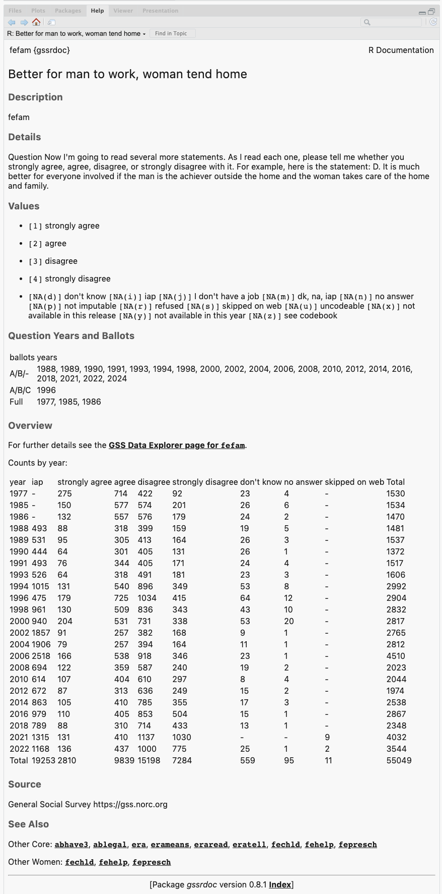

<!-- README.md is generated from README.Rmd. Please edit that file --> 

```{r, include = FALSE}
knitr::opts_chunk$set(
  collapse = TRUE,
  comment = "#>",
  fig.path = "man/figures/README-",
  out.width = "100%"
  )

get_badge <- function (pkg, type = c("last-month", "last-week", "grand-total"), 
    color = "green") 
{
    type <- match.arg(type)
    svg <- paste0("http://cranlogs.r-pkg.org/badges/", type, 
        "/", pkg, "?color=", color)
    url <- paste0("https://cran.r-project.org/package=", pkg)
    placeholder <- "CRAN link"
    paste0("[](", url, ")")
}

library(tidyverse)

```

# gssr 

<!-- badges: start -->
[](https://github.com/kjhealy/gssr/actions/workflows/R-CMD-check.yaml)
[](https://kjhealy.r-universe.dev/gssr)
<!-- badges: end -->

The General Social Survey Cumulative Data (1972-2024, release 1) and Panel Data files packaged for easy use in R. The companion package to `{gssr}` is [gssrdoc](https://kjhealy.github.io/gssrdoc), which integrates the GSS codebook into R's help system. I recommend you install both packages.


## Installation

`{gssr}` is a data package, bundling several datasets into a convenient format. The relatively large size of the data in the package means it is not suitable for hosting on [CRAN](https://cran.r-project.org/), the core R package repository. The same is true of `{gssrdoc}`.

### Install via R-Universe

My [R Universe](https://kjhealy.r-universe.dev/) provides binary packages for `{gssr}` and `{gssrdoc}`. To install both packages, copy and paste the following code to the R console:

``` r
# Install 'gssr' from 'ropensci' universe
install.packages('gssr', repos =
  c('https://kjhealy.r-universe.dev', 'https://cloud.r-project.org'))

# Also recommended: install 'gssrdoc' as well
install.packages('gssrdoc', repos =
  c('https://kjhealy.r-universe.dev', 'https://cloud.r-project.org'))
```

Because the packages have dependencies that are on CRAN, we add CRAN as well as the R Universe to the `repos` argument.

The binary packages will install noticeably quicker than building the package from source. Plus, you can use `install.packages()` directly.


### Install direct from GitHub

You can also install gssr from [GitHub](https://github.com/kjhealy/gssr) with:

``` r
remotes::install_github("kjhealy/gssr")
```

## Loading the data

```{r load}
library(gssr)
```

### Single GSS years

You can get the data for any single GSS year by using `gss_get_yr()` to download it from NORC and put it directly into a tibble.

```{r oneyear}
gss18 <- gss_get_yr(2018)

gss18
```


### The Cumulative Data File

The GSS cumulative data file is large. It is included in`gssr` but not loaded by default when you invoke the package. (That is, `gssr` does not use R's "lazy loading" facility. The data file is too big to do this without error.) To load it (or the other) datasets, first load the library and then use `data()` to make the data available. For example, load the cumulative GSS file like this:

```{r all}
data(gss_all)
```

This will take a moment. Once it is ready, the `gss_all` object is available to use in the usual way:

```{r peek}
gss_all
```

## Integrated Help with `gssrdoc`

`{gssr}`'s companion package, [gssrdoc](https://kjhealy.github.io/gssrdoc/) provides documentation for all GSS variables in the cumulative data file via R's help system. You can browse variables by name in the package's help file or type `?` followed by the name of the variable at the console to get a standard R help page containing information on the variable, the values it takes and (in most cases) a crosstabulation of the variable's values for each year of the GSS. This facility is particularly convenient in an IDE such as RStudio or Microsoft Visual Studio.



## Which questions were asked in which years?

We often want to know which years a question or group of questions was asked. We can find this out for one or more variables with `gss_which_years()`.

```r
gss_which_years(gss_all, fefam)

#> # A tibble: 35 x 2
#>     year fefam
#>    <dbl> <lgl>
#>  1  1972 FALSE
#>  2  1973 FALSE
#>  3  1974 FALSE
#>  4  1975 FALSE
#>  5  1976 FALSE
#>  6  1977 TRUE 
#>  7  1978 FALSE
#>  8  1980 FALSE
#>  9  1982 FALSE
#> 10  1983 FALSE
#> # … with 25 more rows
  
```

When querying more than one variable, use `c()`:

```r
gss_all |> 
  gss_which_years(c(industry, indus80, wrkgovt, commute)) |> 
  print(n = Inf)

# A tibble: 35 × 5
   year      industry indus80 wrkgovt commute
   <dbl+lbl> <lgl>    <lgl>   <lgl>   <lgl>  
## 1972      TRUE     FALSE   FALSE   FALSE  
## 1973      TRUE     FALSE   FALSE   FALSE  
## 1974      TRUE     FALSE   FALSE   FALSE  
## 1975      TRUE     FALSE   FALSE   FALSE  
## 1976      TRUE     FALSE   FALSE   FALSE  
## 1977      TRUE     FALSE   FALSE   FALSE  
## 1978      TRUE     FALSE   FALSE   FALSE  
## 1980      TRUE     FALSE   FALSE   FALSE  
## 1982      TRUE     FALSE   FALSE   FALSE  
## 1983      TRUE     FALSE   FALSE   FALSE  
## 1984      TRUE     FALSE   FALSE   FALSE  
## 1985      TRUE     FALSE   TRUE    FALSE  
## 1986      TRUE     FALSE   TRUE    TRUE   
## 1987      TRUE     FALSE   FALSE   FALSE  
## 1988      TRUE     TRUE    FALSE   FALSE  
## 1989      TRUE     TRUE    FALSE   FALSE  
## 1990      TRUE     TRUE    FALSE   FALSE  
## 1991      FALSE    TRUE    FALSE   FALSE  
## 1993      FALSE    TRUE    FALSE   FALSE  
## 1994      FALSE    TRUE    FALSE   FALSE  
## 1996      FALSE    TRUE    FALSE   FALSE  
## 1998      FALSE    TRUE    FALSE   FALSE  
## 2000      FALSE    TRUE    TRUE    FALSE  
## 2002      FALSE    TRUE    TRUE    FALSE  
## 2004      FALSE    TRUE    TRUE    FALSE  
## 2006      FALSE    TRUE    TRUE    FALSE  
## 2008      FALSE    TRUE    TRUE    FALSE  
## 2010      FALSE    TRUE    TRUE    FALSE  
## 2012      FALSE    FALSE   TRUE    FALSE  
## 2014      FALSE    FALSE   TRUE    FALSE  
## 2016      FALSE    FALSE   TRUE    FALSE  
## 2018      FALSE    FALSE   TRUE    FALSE  
## 2021      FALSE    FALSE   FALSE   FALSE  
## 2022      FALSE    FALSE   FALSE   FALSE  
## 2024      FALSE    FALSE   FALSE   FALSE  
```

## Panel data

In addition to the Cumulative Data File, the gssr package also includes the GSS's panel data. The current rotating panel design began in 2006. A panel of respondents were interviewed that year and followed up on for further interviews in 2008 and 2010. A second panel was interviewed beginning in 2008, and was followed up on for further interviews in 2010 and 2012. And a third panel began in 2010, with follow-up interviews in 2012 and 2014. The `gssr` package provides three datasets, one for each of three-wave panels. They are `gss_panel06_long`, `gss_panel08_long`, and `gss_panel10_long`.  The datasets are provided by the GSS in wide format but (as their names suggest) they are packaged here in long format. The 2020 panel is an exception to this, for reasons described below. The conversion was carried out using the [`panelr` package](https://panelr.jacob-long.com) and its `long_panel()` function. Conversion from long back to wide format is possible with the tools provided in `panelr`.

The panel data objects must be loaded in the same way as the cumulative data file, using `data()`.

```{r panel}
data("gss_panel06_long")

gss_panel06_long
```

Panel data objects are regular tibbles. You do not need to use `panelr` to work with the data.

The column names in long format do not have wave identifiers. Rather,  `firstid` and `wave` variables track the cases. The `firstid` variable is unique for every respondent in the panel and has no missing values. The `wave` variable indexes responses from a given `firstid` panelist in each wave (if observed). The `id` variable is from the GSS and indexes individuals within waves.


```{r panel-example}
data("gss_panel08_long")

gss_panel08_long  |>  
  select(firstid, wave, id, sex)
```

We can look at attrition across waves with, e.g.:

```{r attrition}
gss_panel06_long |> 
  select(wave, id) |>
  group_by(wave) |>
  summarize(observed = n_distinct(id),
            missing = sum(is.na(id)))
```

## The 2020 Panel Data

The COVID-19 pandemic also affected the panel data design. In 2020, the GSS was run as two studies; namely, (1) a panel re-interview of past respondents from the 2016 and 2018 cross sectional GSS studies (referred to as the 2016-2020 GSS Panel), and (2) an independent fresh cross-sectional address-based sampling push to web study (referred to as 2020 cross-sectional survey). The `gssr` package provides the data for the first study as  `gss_panel20`. This study empaneled former 2016 and 2018 GSS respondents to answer a GSS questionnaire in 2020 (i.e., the 2016-2020 GSS panel). In the 2016-2020 GSS Panel, variables only contain data from one of the three years. To differentiate between versions of each variable, they have been appended with suffixes. Variables from 2016 (Wave 1a) have `_1a` appended, variables from 2018 (Wave 1b) have `_1b` appended, and variables from 2020 (Wave 2) have `_2` appended. Users can also track cases from 2016 and 2018, and reinterviews from 2020 with the variable `samptype`. 


```{r}
data("gss_panel20")
gss_panel20
```

Unlike the other panels, these data are provided in wide format. Users are strongly encouraged to read the [official documentation](https://gss.norc.org/Documents/codebook/2016-2020%20GSS%20Panel%20Codebook%20-%20R1a.pdf) at the NORC website.

## Official GSS Documentation

The [GSS Documentation Page](https://gss.norc.org/us/en/gss/get-documentation.html) contains links to extensive technical documentation for the survey, including [Release Notes for the 1972-2024 Cumulative File](https://gss.norc.org/content/dam/gss/get-documentation/pdf/other/Release%20Notes%207224.pdf) and [What's New in 2024](https://gss.norc.org/content/dam/gss/get-documentation/pdf/other/GSS%202024%20-%20Whats%20New.pdf).


## Further details

The package is documented at <http://kjhealy.github.io/gssr/>. The GSS homepage is at <http://gss.norc.org/>. While the `gssr` package incorporates the publicly-available GSS cumulative data file, this package is not associated with or endorsed by the National Opinion Research Center or the General Social Survey. 

