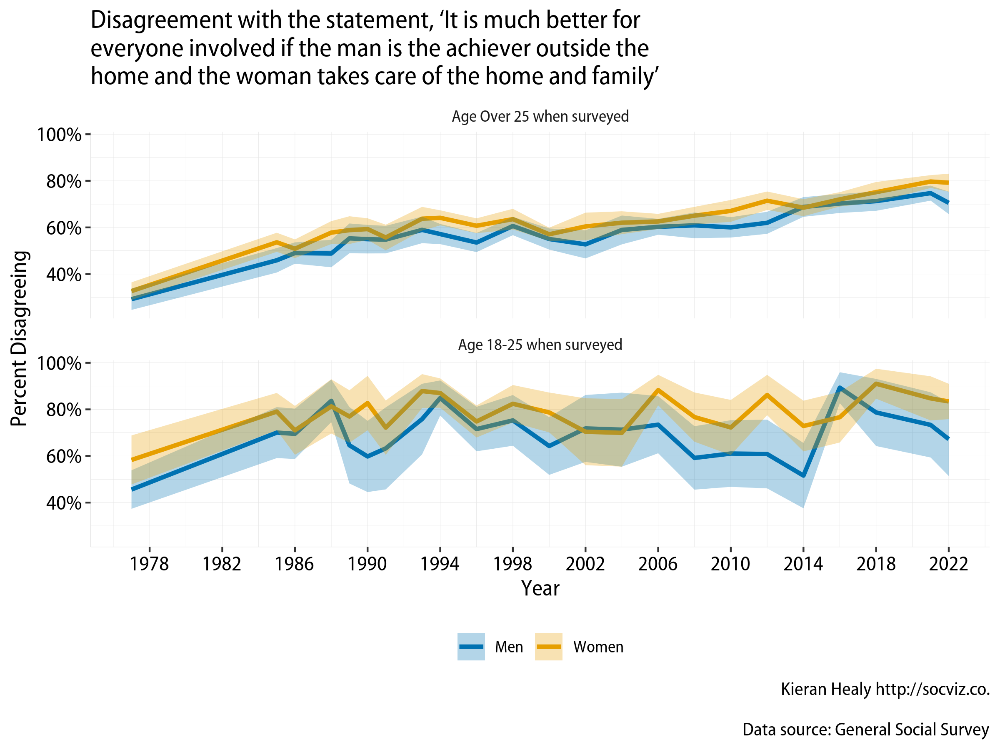

<!-- README.md is generated from README.Rmd. Please edit that file -->

```{r, include = FALSE}
knitr::opts_chunk$set(
  collapse = TRUE,
  comment = "#>",
  fig.path = "man/figures/README-",
  out.width = "100%"
  )

get_badge <- function (pkg, type = c("last-month", "last-week", "grand-total"), 
    color = "green") 
{
    type <- match.arg(type)
    svg <- paste0("http://cranlogs.r-pkg.org/badges/", type, 
        "/", pkg, "?color=", color)
    url <- paste0("https://cran.r-project.org/package=", pkg)
    placeholder <- "CRAN link"
    paste0("[](", url, ")")
}

library(tidyverse)

```

# gssr 

<!-- badges: start -->
[](https://github.com/kjhealy/gssr/actions)

<!-- badges: end -->

The General Social Survey Cumulative Data (1972-2018) and Three Wave Panel Data files packaged for easy use in R. 



## Installation

`gssr` is a data package, bundling several datasets into a convenient format. The relatively large size of the data in the package means it is not suitable for hosting on [CRAN](https://cran.r-project.org/), the core R package repository. There are two ways to install it.

### Install direct from GitHub

You can install the beta version of gssr from [GitHub](https://github.com/kjhealy/gssr) with:

``` r
devtools::install_github("kjhealy/gssr")
```

### Installation using `drat`

While using `install_github()` works just fine, it would be nicer to be able to just type `install.packages("gssr")` or `update.packages("gssr")` in the ordinary way. We can do this using Dirk Eddelbuettel's [drat](http://eddelbuettel.github.io/drat/DratForPackageUsers.html) package. Drat provides a convenient way to make R aware of package repositories other than CRAN.

First, install `drat`:

```{r drat, eval = FALSE}
if (!require("drat")) {
    install.packages("drat")
    library("drat")
}
```

Then use `drat` to tell R about the repository where `gssr` is hosted:

```{r drat-gssr}
drat::addRepo("kjhealy")
```

You can now install `gssr`:

```{r gssr-drat, eval = FALSE}
install.packages("gssr")
```

To ensure that the `gssr` repository is always available, you can add the following line to your `.Rprofile` or `.Rprofile.site` file:

```{r rprofile}
drat::addRepo("kjhealy")
```

With that in place you'll be able to do `install.packages("gssr")` or `update.packages("gssr")` and have everything work as you'd expect. 

Note that the drat repository only contains data packages that are not on CRAN, so you will never be in danger of grabbing the wrong version of any other package.

## Loading the data

### The Cumulative Data File

The GSS cumulative data file is large. It is not loaded by default when you invoke the package. (That is, `gssr` does not use R's "lazy loading" facility. The data file is too big to have use this without error.) To load one of the datasets, first load the library and then use `data()` to make the data available. For example, load the cumulative GSS file like this:

```{r load}
library(gssr)
data(gss_all)
```

This will take a moment. Once it is ready, the `gss_all` object is available to use in the usual way:

```{r peek}
gss_all
```

To load the tibble that contains information on the variables in the data, do this:

```{r load-doc}
data(gss_doc)
gss_doc
```

You can take a look at information on a particular variable by doing something like this:

```{r varlook}

gss_doc %>% filter(id == "race") %>% 
  select(id, description, text)

```

To look at a variable's marginals or its properties, use `unnest()`:

```{r marginals}

gss_doc %>% filter(id == "race") %>%
  select(marginals) %>% 
  unnest(cols = c(marginals))

```


```{r properties}

gss_doc %>% filter(id == "race") %>%
    select(properties) %>%
    unnest(cols = c(properties))

```

There are convenience functions to do this as well, for one or more categorical variables. One for the marginals:

```{r getfnex}
gss_get_marginals(varnames = c("race", "sex"))
```

And one for the properties:

```{r getfnex2}
gss_get_props(varnames = c("race", "sex"))
```

## Panel Data

In addition to the Cumulative Data File, the gssr package also includes the GSS's panel data. The current rotating panel design began in 2006. A panel of respondents were interviewed that year and followed up on for further interviews in 2008 and 2010. A second panel was interviewed beginning in 2008, and was followed up on for further interviews in 2010 and 2012. And a third panel began in 2010, with follow-up interviews in 2012 and 2014. The `gssr` package provides three datasets, one for each of three-wave panels. They are `gss_panel06_long`, `gss_panel08_long`, and `gss_panel10_long`.  The datasets are provided by the GSS in wide format but (as their names suggest) they are packaged here in long format. The conversion was carried out using the [`panelr` package](https://panelr.jacob-long.com) and its `long_panel()` function. Conversion from long back to wide format is possible with the tools provided in `panelr`.

The panel data objects must be loaded in the same way as the cumulative data file.

```{r panel}
data(gss_panel06_long)

gss_panel06_long
```

Although the panel data objects were created by `panelr`, they are regular tibbles. You do not need to use `panelr` to work with the data.

The column names in long format do not have wave identifiers. Rather,  `firstid` and `wave` variables track the cases. The `firstid` variable is unique for every respondent in the panel and has no missing values. The `wave` variable indexes responses from a given `firstid` panelist in each wave (if observed). The `id` variable is from the GSS and indexes individuals within waves.

```{r panel-example}
gss_panel08_long %>% 
  select(firstid, wave, id, sex)
```

We can look at attrition across waves with, e.g.:

```{r attrition}
gss_panel06_long %>% 
  select(wave, id) %>%
  group_by(wave) %>%
  summarize(observed = n_distinct(id),
            missing = sum(is.na(id)))
```

The documentation tibble for the panel data is called `gss_panel_doc`.

```{r paneldoc}
data(gss_panel_doc)

gss_panel_doc
```

Because it was created from the main GSS codebook, it is in wide format. The time-varying variables have wave identifiers. The identifiers are the suffixes `_1`, `_2`, and `_3`, for the first, second, and third waves. The variable names are capitalized. The categorical variables in the panel codebook can be queried in the same way as those in the cumulative codebook. We specify that we want to look at `gss_panel_doc` rather than `gss_doc`.

```{r paneldocfun}
gss_get_marginals(varnames = c("SEX_1", "SEX_2", "SEX_3"), data = gss_panel_doc)
```

## Further details

The package is documented at <http://kjhealy.github.io/gssr/>. The GSS homepage is at <http://gss.norc.org/>. While the `gssr` package incorporates the publicly-available GSS cumulative data file, the package is not associated with or endorsed by the National Opinion Research Center or the General Social Survey. 

