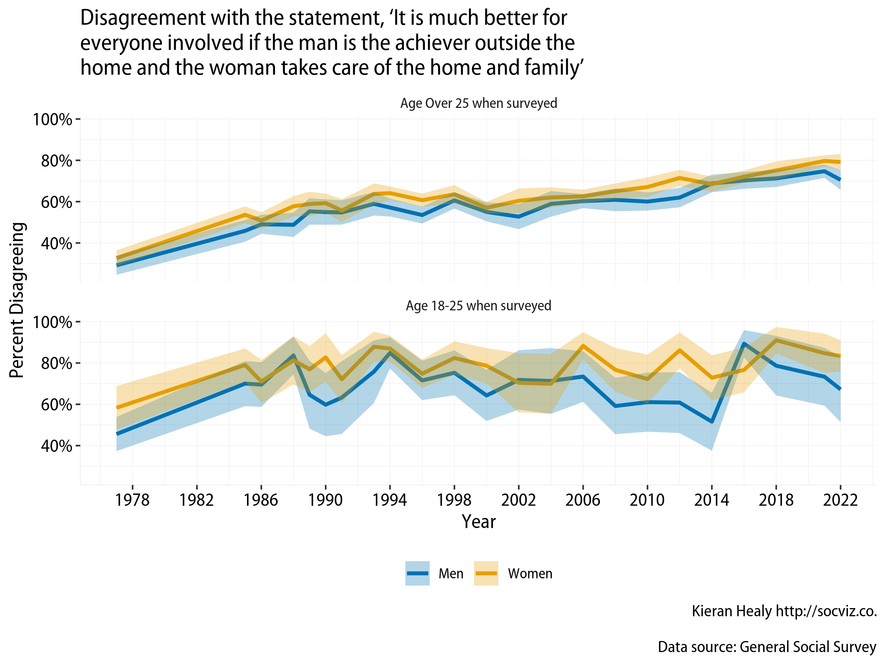
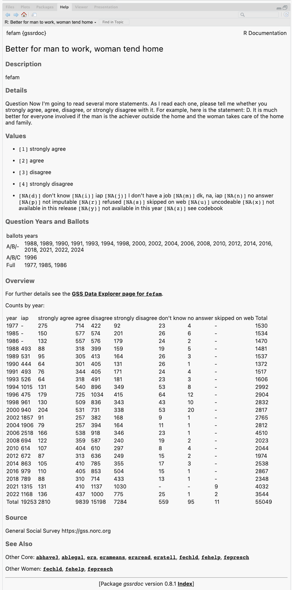

<!-- README.md is generated from README.Rmd. Please edit that file -->

# gssr 

The General Social Survey Cumulative Data (1972-2022, release 2a) and
Panel Data files packaged for easy use in R.



## Installation

`gssr` is a data package, bundling several datasets into a convenient
format. The relatively large size of the data in the package means it is
not suitable for hosting on [CRAN](https://cran.r-project.org/), the
core R package repository.

### Install direct from GitHub

You can install gssr from [GitHub](https://github.com/kjhealy/gssr)
with:

``` r
remotes::install_github("kjhealy/gssr")
```

## Loading the data

``` r
library(gssr)
#> Package loaded. To attach the GSS data, type data(gss_all) at the console.
#> For the codebook, type data(gss_dict).
#> For the panel data and documentation, type e.g. data(gss_panel08_long) and data(gss_panel_doc).
#> For help on a specific GSS variable, type ?varname at the console.
```

### Single GSS years

You can get the data for any single GSS year by using `gss_get_yr()` to
download it from NORC and put it directly into a tibble.

``` r
gss18 <- gss_get_yr(2018)
#> Fetching: https://gss.norc.org/documents/stata/2018_stata.zip

gss18
#> # A tibble: 2,348 × 1,068
#>    year         id wrkstat   hrs1        hrs2        evwork      wrkslf  wrkgovt
#>    <dbl+lbl> <dbl> <dbl+lbl> <dbl+lbl>   <dbl+lbl>   <dbl+lbl>   <dbl+l> <dbl+l>
#>  1 2018          1 3 [with … NA(i) [iap]    41       NA(i) [iap] 2 [som… 2 [pri…
#>  2 2018          2 5 [retir… NA(i) [iap] NA(i) [iap]     1 [yes] 2 [som… 2 [pri…
#>  3 2018          3 1 [worki…    40       NA(i) [iap] NA(i) [iap] 2 [som… 2 [pri…
#>  4 2018          4 1 [worki…    40       NA(i) [iap] NA(i) [iap] 2 [som… 2 [pri…
#>  5 2018          5 5 [retir… NA(i) [iap] NA(i) [iap]     1 [yes] 2 [som… 2 [pri…
#>  6 2018          6 5 [retir… NA(i) [iap] NA(i) [iap]     1 [yes] 2 [som… 2 [pri…
#>  7 2018          7 1 [worki…    35       NA(i) [iap] NA(i) [iap] 2 [som… 1 [gov…
#>  8 2018          8 1 [worki…    89 [89+… NA(i) [iap] NA(i) [iap] 2 [som… 2 [pri…
#>  9 2018          9 1 [worki…    40       NA(i) [iap] NA(i) [iap] 1 [sel… 2 [pri…
#> 10 2018         10 1 [worki…    40       NA(i) [iap] NA(i) [iap] 2 [som… 2 [pri…
#> # ℹ 2,338 more rows
#> # ℹ 1,060 more variables: occ10 <dbl+lbl>, prestg10 <dbl+lbl>,
#> #   prestg105plus <dbl+lbl>, indus10 <dbl+lbl>, marital <dbl+lbl>,
#> #   martype <dbl+lbl>, divorce <dbl+lbl>, widowed <dbl+lbl>,
#> #   spwrksta <dbl+lbl>, sphrs1 <dbl+lbl>, sphrs2 <dbl+lbl>, spevwork <dbl+lbl>,
#> #   cowrksta <dbl+lbl>, cowrkslf <dbl+lbl>, coevwork <dbl+lbl>,
#> #   cohrs1 <dbl+lbl>, cohrs2 <dbl+lbl>, spwrkslf <dbl+lbl>, …
```

### The Cumulative Data File

The GSS cumulative data file is large. It is included in`gssr` but not
loaded by default when you invoke the package. (That is, `gssr` does not
use R’s “lazy loading” facility. The data file is too big to do this
without error.) To load it (or the other) datasets, first load the
library and then use `data()` to make the data available. For example,
load the cumulative GSS file like this:

``` r
data(gss_all)
```

This will take a moment. Once it is ready, the `gss_all` object is
available to use in the usual way:

``` r
gss_all
#> # A tibble: 72,390 × 6,694
#>    year         id wrkstat    hrs1        hrs2        evwork      occ   prestige
#>    <dbl+lbl> <dbl> <dbl+lbl>  <dbl+lbl>   <dbl+lbl>   <dbl+lbl>   <dbl> <dbl+lb>
#>  1 1972          1 1 [workin… NA(i) [iap] NA(i) [iap] NA(i) [iap] 205   50      
#>  2 1972          2 5 [retire… NA(i) [iap] NA(i) [iap]     1 [yes] 441   45      
#>  3 1972          3 2 [workin… NA(i) [iap] NA(i) [iap] NA(i) [iap] 270   44      
#>  4 1972          4 1 [workin… NA(i) [iap] NA(i) [iap] NA(i) [iap]   1   57      
#>  5 1972          5 7 [keepin… NA(i) [iap] NA(i) [iap]     1 [yes] 385   40      
#>  6 1972          6 1 [workin… NA(i) [iap] NA(i) [iap] NA(i) [iap] 281   49      
#>  7 1972          7 1 [workin… NA(i) [iap] NA(i) [iap] NA(i) [iap] 522   41      
#>  8 1972          8 1 [workin… NA(i) [iap] NA(i) [iap] NA(i) [iap] 314   36      
#>  9 1972          9 2 [workin… NA(i) [iap] NA(i) [iap] NA(i) [iap] 912   26      
#> 10 1972         10 1 [workin… NA(i) [iap] NA(i) [iap] NA(i) [iap] 984   18      
#> # ℹ 72,380 more rows
#> # ℹ 6,686 more variables: wrkslf <dbl+lbl>, wrkgovt <dbl+lbl>,
#> #   commute <dbl+lbl>, industry <dbl+lbl>, occ80 <dbl+lbl>, prestg80 <dbl+lbl>,
#> #   indus80 <dbl+lbl>, indus07 <dbl+lbl>, occonet <dbl+lbl>, found <dbl+lbl>,
#> #   occ10 <dbl+lbl>, occindv <dbl+lbl>, occstatus <dbl+lbl>, occtag <dbl+lbl>,
#> #   prestg10 <dbl+lbl>, prestg105plus <dbl+lbl>, indus10 <dbl+lbl>,
#> #   indstatus <dbl+lbl>, indtag <dbl+lbl>, marital <dbl+lbl>, …
```

## Integrated Help

Beginning with version 0.4, `gssr` provides documentation for all GSS
variables in the cumulative data file via R’s help system. You can
browse variables by name in the package’s help file or type `?` followed
by the name of the variable at the console to get a standard R help page
containing information on the variable, the values it takes and (in most
cases) a crosstabulation of the variable’s values for each year of the
GSS. This facility is particularly convenient in an IDE such as RStudio
or Microsoft Visual Studio.



Information about the variables is also contained in the `gss_dict`
object:

``` r
data(gss_dict)
gss_dict
#> # A tibble: 6,663 × 13
#>      pos variable label     missing var_doc_label value_labels var_text years   
#>    <int> <chr>    <chr>       <int> <chr>         <chr>        <chr>    <list>  
#>  1     1 year     gss year…       0 gss year for… [NA(d)] don… None     <NULL>  
#>  2     2 wrkstat  labor fo…      36 labor force … [1] working… 1. Last… <tibble>
#>  3     3 hrs1     number o…   30830 number of ho… [89] 89+ ho… 1a. If … <tibble>
#>  4     4 hrs2     number o…   70989 number of ho… [89] 89+ ho… 1b. If … <tibble>
#>  5     5 evwork   ever wor…   46944 ever work as… [1] yes; [2… 1c. If … <tibble>
#>  6     6 occ      r's cens…   48123 r's census o… [NA(d)] don… 2a. Wha… <tibble>
#>  7     7 prestige r's occu…   48123 r's occupati… [NA(d)] don… 2a. Wha… <tibble>
#>  8     8 wrkslf   r self-e…    4041 r self-emp o… [1] self-em… 2e. (Ar… <tibble>
#>  9     9 wrkgovt  govt or …   44311 govt or priv… [1] governm… 2f. (Ar… <tibble>
#> 10    10 commute  travel t…   71060 travel time … [97] 97+ mi… 2g. Abo… <tibble>
#> # ℹ 6,653 more rows
#> # ℹ 5 more variables: var_yrtab <list>, var_ballots <list>, col_type <chr>,
#> #   var_type <chr>, var_na_codes <chr>
```

## Which questions were asked in which years?

We often want to know which years a question or group of questions was
asked. We can find this out for one or more variables with
`gss_which_years()`.

``` r
gss_which_years(gss_all, fefam)

#> # A tibble: 33 x 2
#>     year fefam
#>    <dbl> <lgl>
#>  1  1972 FALSE
#>  2  1973 FALSE
#>  3  1974 FALSE
#>  4  1975 FALSE
#>  5  1976 FALSE
#>  6  1977 TRUE 
#>  7  1978 FALSE
#>  8  1980 FALSE
#>  9  1982 FALSE
#> 10  1983 FALSE
#> # … with 24 more rows
  
```

When querying more than one variable, use `c()`:

``` r
gss_all |> 
  gss_which_years(c(industry, indus80, wrkgovt, commute)) |> 
  print(n = Inf)

## # A tibble: 34 × 5
##    year      industry indus80 wrkgovt commute
##    <dbl+lbl> <lgl>    <lgl>   <lgl>   <lgl>  
##  1 1972      TRUE     FALSE   FALSE   FALSE  
##  2 1973      TRUE     FALSE   FALSE   FALSE  
##  3 1974      TRUE     FALSE   FALSE   FALSE  
##  4 1975      TRUE     FALSE   FALSE   FALSE  
##  5 1976      TRUE     FALSE   FALSE   FALSE  
##  6 1977      TRUE     FALSE   FALSE   FALSE  
##  7 1978      TRUE     FALSE   FALSE   FALSE  
##  8 1980      TRUE     FALSE   FALSE   FALSE  
##  9 1982      TRUE     FALSE   FALSE   FALSE  
## 10 1983      TRUE     FALSE   FALSE   FALSE  
## 11 1984      TRUE     FALSE   FALSE   FALSE  
## 12 1985      TRUE     FALSE   TRUE    FALSE  
## 13 1986      TRUE     FALSE   TRUE    TRUE   
## 14 1987      TRUE     FALSE   FALSE   FALSE  
## 15 1988      TRUE     TRUE    FALSE   FALSE  
## 16 1989      TRUE     TRUE    FALSE   FALSE  
## 17 1990      TRUE     TRUE    FALSE   FALSE  
## 18 1991      FALSE    TRUE    FALSE   FALSE  
## 19 1993      FALSE    TRUE    FALSE   FALSE  
## 20 1994      FALSE    TRUE    FALSE   FALSE  
## 21 1996      FALSE    TRUE    FALSE   FALSE  
## 22 1998      FALSE    TRUE    FALSE   FALSE  
## 23 2000      FALSE    TRUE    TRUE    FALSE  
## 24 2002      FALSE    TRUE    TRUE    FALSE  
## 25 2004      FALSE    TRUE    TRUE    FALSE  
## 26 2006      FALSE    TRUE    TRUE    FALSE  
## 27 2008      FALSE    TRUE    TRUE    FALSE  
## 28 2010      FALSE    TRUE    TRUE    FALSE  
## 29 2012      FALSE    FALSE   TRUE    FALSE  
## 30 2014      FALSE    FALSE   TRUE    FALSE  
## 31 2016      FALSE    FALSE   TRUE    FALSE  
## 32 2018      FALSE    FALSE   TRUE    FALSE  
## 33 2021      FALSE    FALSE   FALSE   FALSE  
## 34 2022      FALSE    FALSE   FALSE   FALSE 
```

## Which ballots did a question appear on?

Use `gss_which_ballots()` for this.

``` r
gss_which_ballots(fefam) |> print(n=Inf)
#> # A tibble: 23 × 5
#>    year  `(None)` `ballot a` `ballot b` `ballot c`
#>    <chr> <chr>    <chr>      <chr>      <chr>     
#>  1 1977  Y        -          -          -         
#>  2 1985  Y        -          -          -         
#>  3 1986  Y        -          -          -         
#>  4 1988  -        Y          Y          -         
#>  5 1989  -        Y          Y          -         
#>  6 1990  -        Y          Y          -         
#>  7 1991  -        Y          Y          -         
#>  8 1993  -        Y          Y          -         
#>  9 1994  -        Y          Y          -         
#> 10 1996  -        Y          Y          Y         
#> 11 1998  -        Y          Y          -         
#> 12 2000  -        Y          Y          -         
#> 13 2002  -        Y          Y          -         
#> 14 2004  -        Y          Y          -         
#> 15 2006  -        Y          Y          -         
#> 16 2008  -        Y          Y          -         
#> 17 2010  -        Y          Y          -         
#> 18 2012  -        Y          Y          -         
#> 19 2014  -        Y          Y          -         
#> 20 2016  -        Y          Y          -         
#> 21 2018  -        Y          Y          -         
#> 22 2021  -        Y          Y          -         
#> 23 2022  -        Y          Y          -
```

## Panel data

In addition to the Cumulative Data File, the gssr package also includes
the GSS’s panel data. The current rotating panel design began in 2006. A
panel of respondents were interviewed that year and followed up on for
further interviews in 2008 and 2010. A second panel was interviewed
beginning in 2008, and was followed up on for further interviews in 2010
and 2012. And a third panel began in 2010, with follow-up interviews in
2012 and 2014. The `gssr` package provides three datasets, one for each
of three-wave panels. They are `gss_panel06_long`, `gss_panel08_long`,
and `gss_panel10_long`. The datasets are provided by the GSS in wide
format but (as their names suggest) they are packaged here in long
format. The 2020 panel is an exception to this, for reasons described
below. The conversion was carried out using the [`panelr`
package](https://panelr.jacob-long.com) and its `long_panel()` function.
Conversion from long back to wide format is possible with the tools
provided in `panelr`.

The panel data objects must be loaded in the same way as the cumulative
data file, using `data()`.

``` r
data("gss_panel06_long")

gss_panel06_long
#> # A tibble: 6,000 × 1,572
#>    firstid  wave ballot      form    formwt oversamp sampcode sample  samptype  
#>    <fct>   <dbl> <dbl+lbl>   <dbl+l>  <dbl>    <dbl> <dbl+lb> <dbl+l> <dbl+lbl> 
#>  1 9           1 3 [BALLOT … 2 [ALT…      1        1 501      9 [200… 2006 [200…
#>  2 9           2 3 [BALLOT … 2 [ALT…      1        1 501      9 [200… 2006 [200…
#>  3 9           3 3 [BALLOT … 2 [ALT…      1        1 501      9 [200… 2006 [200…
#>  4 10          1 1 [BALLOT … 1 [STA…      1        1 501      9 [200… 2006 [200…
#>  5 10          2 1 [BALLOT … 1 [STA…      1        1 501      9 [200… 2006 [200…
#>  6 10          3 1 [BALLOT … 1 [STA…      1        1 501      9 [200… 2006 [200…
#>  7 11          1 3 [BALLOT … 2 [ALT…      1        1 501      9 [200… 2006 [200…
#>  8 11          2 3 [BALLOT … 2 [ALT…      1        1 501      9 [200… 2006 [200…
#>  9 11          3 3 [BALLOT … 2 [ALT…      1        1 501      9 [200… 2006 [200…
#> 10 12          1 1 [BALLOT … 2 [ALT…      1        1 501      9 [200… 2006 [200…
#> # ℹ 5,990 more rows
#> # ℹ 1,563 more variables: vstrat <dbl+lbl>, vpsu <dbl+lbl>, wtpan12 <dbl+lbl>,
#> #   wtpan123 <dbl+lbl>, wtpannr12 <dbl+lbl>, wtpannr123 <dbl+lbl>,
#> #   letin1a <dbl+lbl>, abany <dbl+lbl>, abdefect <dbl+lbl>, abhlth <dbl+lbl>,
#> #   abnomore <dbl+lbl>, abpoor <dbl+lbl>, abrape <dbl+lbl>, absingle <dbl+lbl>,
#> #   accntsci <dbl+lbl>, acqasian <dbl+lbl>, acqattnd <dbl+lbl>,
#> #   acqblack <dbl+lbl>, acqbrnda <dbl+lbl>, acqchild <dbl+lbl>, …
```

Panel data objects are regular tibbles. You do not need to use `panelr`
to work with the data.

The column names in long format do not have wave identifiers. Rather,
`firstid` and `wave` variables track the cases. The `firstid` variable
is unique for every respondent in the panel and has no missing values.
The `wave` variable indexes responses from a given `firstid` panelist in
each wave (if observed). The `id` variable is from the GSS and indexes
individuals within waves.

``` r
data("gss_panel08_long")

gss_panel08_long  |>  
  select(firstid, wave, id, sex)
#> # A tibble: 6,069 × 4
#>    firstid  wave id        sex      
#>    <fct>   <dbl> <dbl+lbl> <dbl+lbl>
#>  1 1           1    1       1 [MALE]
#>  2 1           2 8001       1 [MALE]
#>  3 1           3   NA      NA       
#>  4 2           1    2       1 [MALE]
#>  5 2           2 8002       1 [MALE]
#>  6 2           3 8001       1 [MALE]
#>  7 3           1    3       1 [MALE]
#>  8 3           2 8003       1 [MALE]
#>  9 3           3 8002       1 [MALE]
#> 10 4           1    4       1 [MALE]
#> # ℹ 6,059 more rows
```

We can look at attrition across waves with, e.g.:

``` r
gss_panel06_long |> 
  select(wave, id) |>
  group_by(wave) |>
  summarize(observed = n_distinct(id),
            missing = sum(is.na(id)))
#> # A tibble: 3 × 3
#>    wave observed missing
#>   <dbl>    <int>   <int>
#> 1     1     2000       0
#> 2     2     1537     464
#> 3     3     1277     724
```

## The 2020 Panel Data

The COVID-19 pandemic also affected the panel data design. In 2020, the
GSS was run as two studies; namely, (1) a panel re-interview of past
respondents from the 2016 and 2018 cross sectional GSS studies (referred
to as the 2016-2020 GSS Panel), and (2) an independent fresh
cross-sectional address-based sampling push to web study (referred to as
2020 cross-sectional survey). The `gssr` package provides the data for
the first study as `gss_panel20`. This study empaneled former 2016 and
2018 GSS respondents to answer a GSS questionnaire in 2020 (i.e., the
2016-2020 GSS panel). In the 2016-2020 GSS Panel, variables only contain
data from one of the three years. To differentiate between versions of
each variable, they have been appended with suffixes. Variables from
2016 (Wave 1a) have `_1a` appended, variables from 2018 (Wave 1b) have
`_1b` appended, and variables from 2020 (Wave 2) have `_2` appended.
Users can also track cases from 2016 and 2018, and reinterviews from
2020 with the variable `samptype`.

``` r
data("gss_panel20")
gss_panel20
#> # A tibble: 5,215 × 4,296
#>    samptype           yearid fileversion panstat wtssall_1a wtssall_1b wtssall_2
#>    <dbl+lbl>          <chr>  <chr>       <dbl+l>      <dbl>      <dbl>     <dbl>
#>  1 2016 [sample from… 20160… GSS 2020 P… 1 [sel…      0.957         NA     1.09 
#>  2 2016 [sample from… 20160… GSS 2020 P… 1 [sel…      0.478         NA     0.543
#>  3 2016 [sample from… 20160… GSS 2020 P… 0 [not…      0.957         NA    NA    
#>  4 2016 [sample from… 20160… GSS 2020 P… 1 [sel…      1.91          NA     2.17 
#>  5 2016 [sample from… 20160… GSS 2020 P… 0 [not…      1.44          NA    NA    
#>  6 2016 [sample from… 20160… GSS 2020 P… 2 [sel…      0.957         NA    NA    
#>  7 2016 [sample from… 20160… GSS 2020 P… 0 [not…      1.44          NA    NA    
#>  8 2016 [sample from… 20160… GSS 2020 P… 1 [sel…      0.957         NA     1.09 
#>  9 2016 [sample from… 20160… GSS 2020 P… 1 [sel…      0.957         NA     1.09 
#> 10 2016 [sample from… 20160… GSS 2020 P… 0 [not…      0.957         NA    NA    
#> # ℹ 5,205 more rows
#> # ℹ 4,289 more variables: wtssnr_1a <dbl>, wtssnr_1b <dbl>, wtssnr_2 <dbl>,
#> #   vstrat_1a <dbl>, vstrat_1b <dbl>, vstrat_2 <dbl>, vpsu_1a <dbl>,
#> #   vpsu_1b <dbl>, vpsu_2 <dbl>, year_1a <int>, year_1b <int>, year_2 <int>,
#> #   id_1a <dbl>, id_1b <dbl>, id_2 <dbl>, mar1_1a <dbl+lbl>, mar2_1a <dbl+lbl>,
#> #   mar3_1a <dbl+lbl>, mar4_1a <dbl+lbl>, mar5_1a <dbl+lbl>, mar6_1a <dbl+lbl>,
#> #   mar7_1a <dbl+lbl>, mar8_1a <dbl+lbl>, mar9_1a <dbl+lbl>, …
```

Unlike the other panels, these data are provided in wide format. Users
are strongly encouraged to read the [official
documentation](https://gss.norc.org/Documents/codebook/2016-2020%20GSS%20Panel%20Codebook%20-%20R1a.pdf)
at the NORC website.

## The GSS and COVID-19

The GSS administrators have released a [Methodological
Primer](https://gss.norc.org/Documents/other/2021%20XSEC%20R1%20Methodological%20Primer.pdf)
along with the [Documentation and Codebook for the 2021
survey](https://gss.norc.org/Documents/codebook/GSS%202021%20Codebook%20R1.pdf)
that users should read carefully in connection with the effects of
COVID-19 on data collection for the GSS.

The Primer notes:

> Since its inception, the GSS has conducted data collection via
> in-person interviews as its primary mode of data collection. The
> pandemic forced the GSS to change this design, moving from in-person
> to address- based sampling and a push-to-web methodology, with the
> bulk of the interview conducted online via a self- administered
> questionnaire.

In addition,

> We recommend our users include the one of the following statements
> when reporting on the GSS 2021 Cross-section data: *Total Survey Error
> Summary Perspective for the 2021 GSS Cross-section:* Changes in
> opinions, attitudes, and behaviors observed in 2021 relative to
> historical trends may be due to actual change in concept over time
> and/or may have resulted from methodological changes made to the
> survey methodology during the COVID-19 global pandemic.

And,

> *Suggested Statement to Include in Articles and Reports That Use GSS
> Data:* To safeguard the health of staff and respondents during the
> COVID-19 pandemic, the 2021 GSS data collection used a mail-to-web
> methodology instead of its traditional in-person interviews. Research
> and interpretation done using the data should take extra care to
> ensure the analysis reflects actual changes in public opinion and is
> not unduly influenced by the change in data collection methods. For
> more information on the 2021 GSS methodology and its implications,
> please visit <https://gss.norc.org/Get-The-Data>

## Further details

The package is documented at <http://kjhealy.github.io/gssr/>. The GSS
homepage is at <http://gss.norc.org/>. While the `gssr` package
incorporates the publicly-available GSS cumulative data file, this
package is not associated with or endorsed by the National Opinion
Research Center or the General Social Survey.
